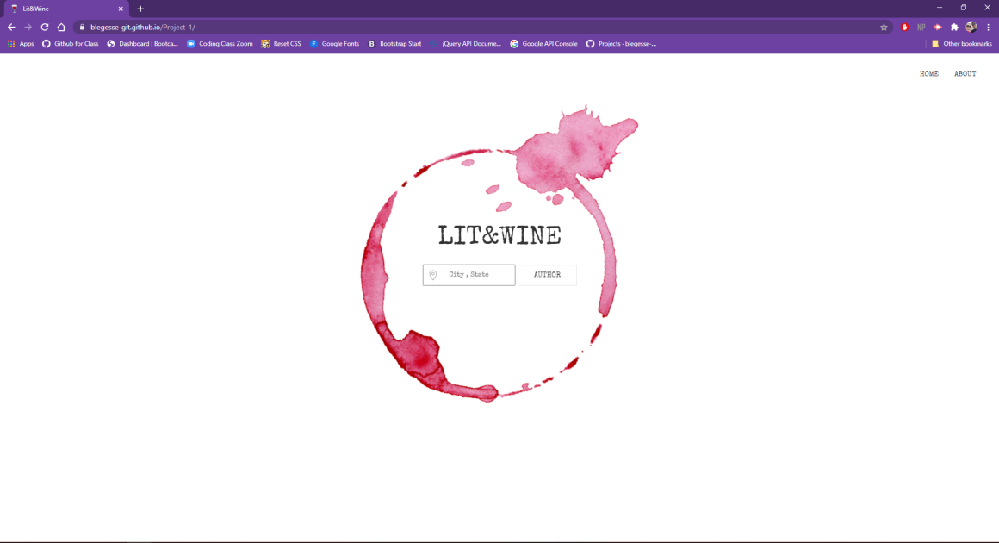

# Project-1

The purpose of the project was to come together as a group and create a web api using at 3 different APIs that'll solve a possible user's solution.

We have developed an app called Lit & Wine.Lit & Wine is a recommendation engine that helps an avid reader pair their choice of genre or author with the corresponding wine. For example: If you enjoy an intense book like a thriller/mystery it suggests a dry wine, or, on the other hand, if you enjoy a light read like a love story or a fantasy, it suggests a sweeter wine.

Our vision for the app is to build a community for readers who can form a virtual book-club and create a profile. It will also enable them to review/critique books and wines they've tried as well as add their suggestions. Our motive is to provide a platform for people to share their profile with friends and family while exploring more books and wines.

## Prerequisites

```
Used Visual Studio Code and chrome's inspector tool to help build and rework code. Built HTML framework and styling with UIKit. APIs used: 
Google Books API
NYT Book Review API
Open Weather Map API

```
https://blegesse-git.github.io/Project-1/

## Process/What was Changed

```
Lit&Wine prioritizes simplicity, efficiency, and visual appeal. It offers the user a simple text-area where they can input location.Users based in the USA can write their City and State. Users located abroad can also use this app by inputting their City and Country. 

Once the user has input their location, they  can then click the main button. Automatically the weather shows up at the top in our navigation bar. 

If we hover over the main button, you will see a list of authors. We chose these authors based on our personal familiarity with their work . That way, we could offer a diverse range of genres and pair the wine more fittingly based on the current weather and genre of the author.

```

## Review

```
We met as a group and worked out what each one of us wanted to focus on when setting up our project. To get the ball rolling, we wrote a list out of the first things we had to do, and everyone picked from that list. As time progressed, we found a synergy between us and things started to rapidly come together. Beth and Diana became our javascript masters, Sahiba found the right framework for us and helped with the problem solving along the way, while I worked on organizing our project, maintaining all our APIs, and sharing motivational gifs and memes. Despite us finding our own special nooks with the project, EVERYONE still helped with all parts of the web app. Anytime someone ran into a problem they couldn’t fix, we met up and found our solution together. 

Several challenges occurred for us but we were able to conquer them all. We went through several APIs before picking our final three. We still can’t believe there isn’t a GOOD, WORKABLE wine API but we had an idea that we loved and we found a way to make it work without it. BUT, our biggest challenge was one... simple... button. Nothing seemed more frustrating than getting a simple reset button to work…. And victory never tasted so sweet when we did get that reset button to work with only one line of code. 

```




- - -
© 2020 Lit & Wine Services, Inc. All Rights Reserved.
